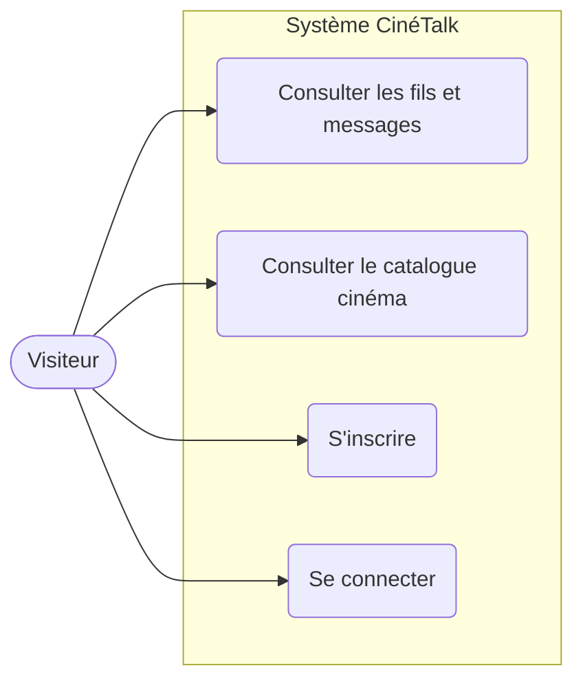
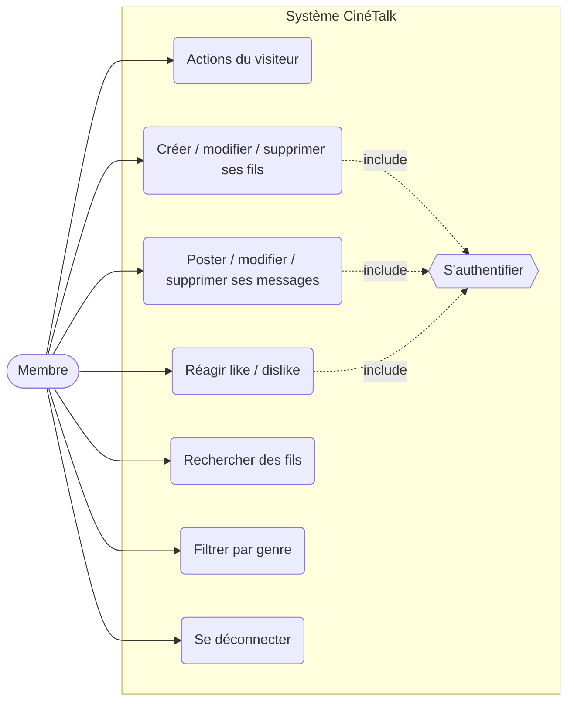
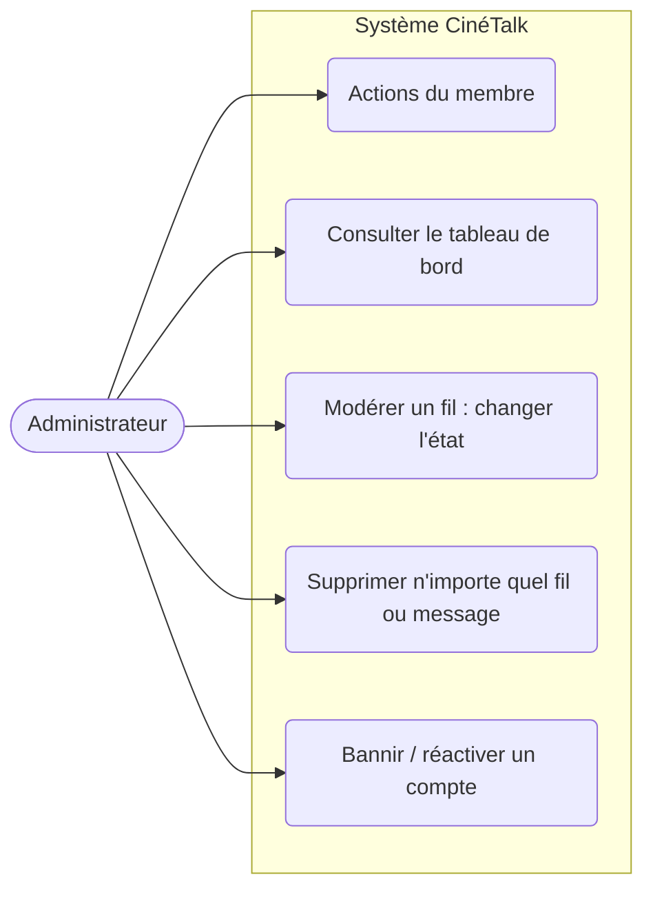
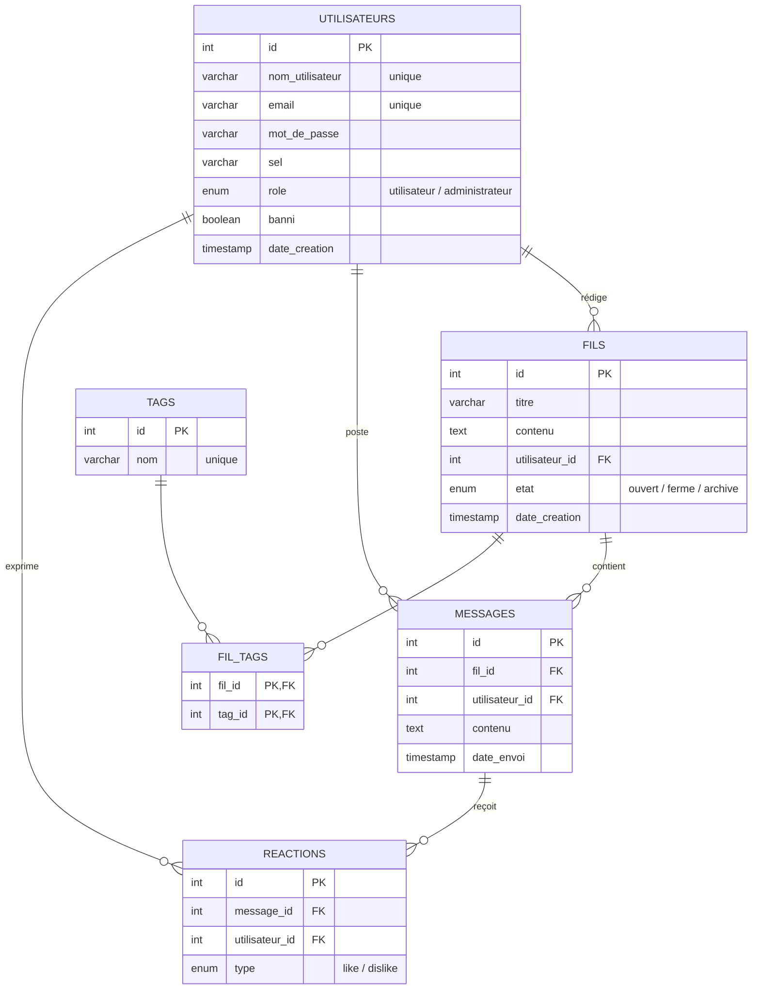

# Conception — CinéTalk (ProjJS.2 Forum)

Livrables de conception demandés par le sujet : **diagrammes de cas d'utilisation par rôle**
et **modèle logique de données (MLD)**.

## 1. Rôles et héritage

Trois rôles, du moins au plus de droits. Chaque rôle hérite des actions du précédent.

- **Visiteur** : non connecté.
- **Membre** : visiteur connecté (hérite des actions du visiteur).
- **Administrateur** : membre avec droits de modération (hérite des actions du membre).

## 2. Cas d'utilisation par rôle

### Visiteur



### Membre (hérite du Visiteur)



### Administrateur (hérite du Membre)



## 3. Modèle logique de données (MLD)

Schéma relationnel issu de `migration/script.sql`.



### Forme textuelle du MLD

```
utilisateurs(#id, nom_utilisateur, email, mot_de_passe, sel, role, banni, date_creation)
tags(#id, nom)
fils(#id, titre, contenu, #utilisateur_id, etat, date_creation)
fil_tags(#fil_id, #tag_id)
messages(#id, #fil_id, #utilisateur_id, contenu, date_envoi)
reactions(#id, #message_id, #utilisateur_id, type)   -- unique(message_id, utilisateur_id)
```

> `#` = clé primaire, soulignement des clés étrangères dans la forme classique.
> La relation **fils ⟷ tags** (plusieurs-à-plusieurs) est résolue par la table d'association `fil_tags`.
> Toutes les clés étrangères sont en `ON DELETE CASCADE`.
