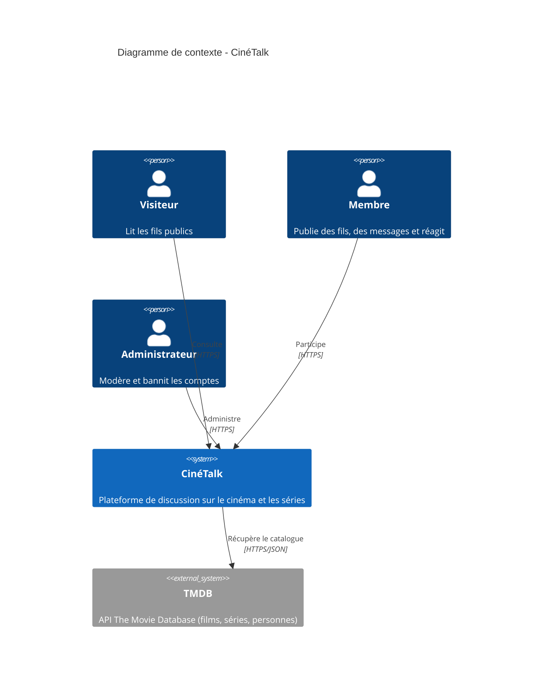
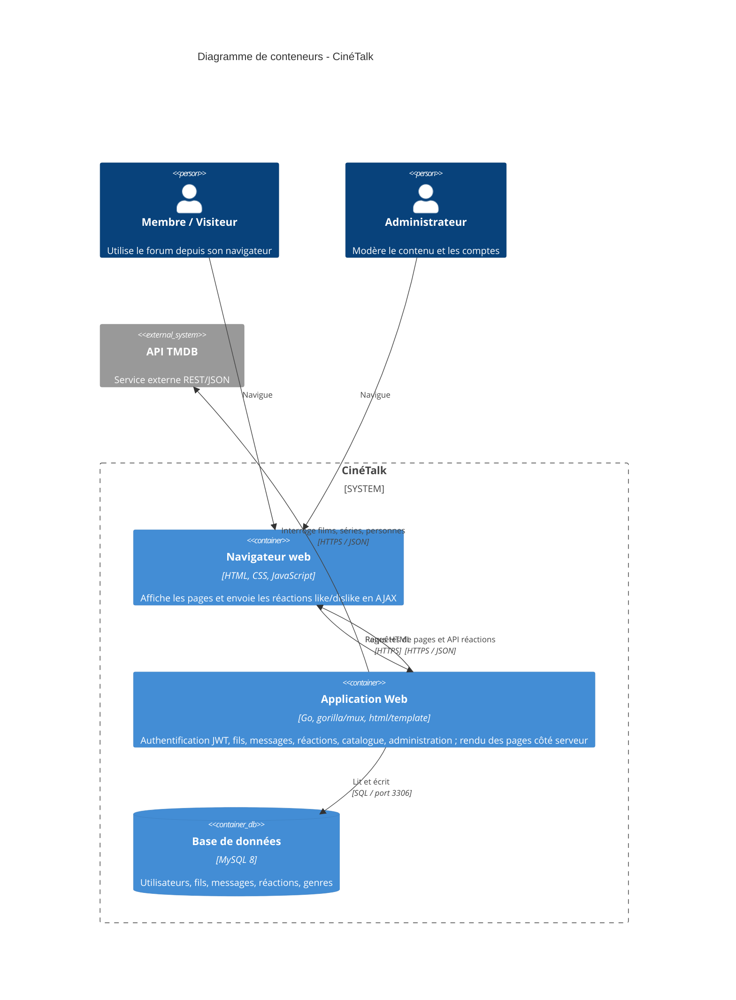
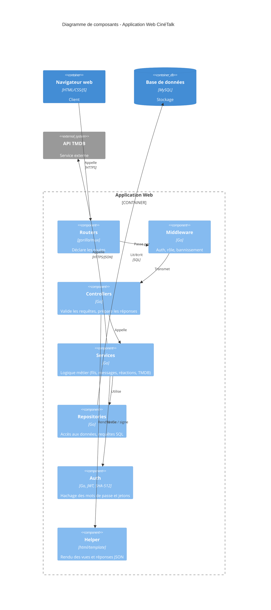

# Diagramme C4 — CinéTalk

Présentation de l'architecture du projet selon le modèle **C4** (Simon Brown).
Le niveau demandé est le **niveau 2 (conteneurs)** ; le niveau 1 (contexte) est ajouté pour situer le système.

## Niveau 1 — Contexte

Vue d'ensemble : qui utilise CinéTalk et à quels systèmes externes il se connecte.

## Niveau 2 — Conteneurs

Les grandes briques techniques exécutables et leurs échanges.
Un « conteneur » au sens C4 = une unité exécutable/déployable (≠ conteneur Docker).

## Niveau 3 — Composants (bonus, intérieur de l'Application Web)

Découpage interne en couches, qui correspond aux dossiers du dépôt.

## Légende

| Élément | Signification |
|---|---|
| `Person` | Acteur humain |
| `Container` | Brique exécutable (app, navigateur) |
| `ContainerDb` | Brique de stockage |
| `Component` | Regroupement de code dans un conteneur |
| `System_Ext` | Système externe (non développé par l'équipe) |
| `Rel` | Relation orientée avec son protocole |

> Les diagrammes Mermaid se rendent directement sur GitHub.
> Pour exporter une image : coller le bloc dans https://mermaid.live (export PNG/SVG),
> ou exécuter `npx -y @mermaid-js/mermaid-cli -i fichier.mmd -o fichier.png`.
